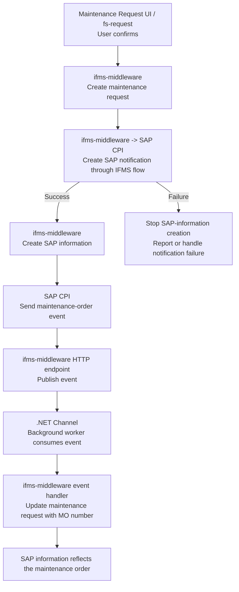

# IFMS maintenance-request flow

## Responsibility and ordering

The maintenance-request UI (`fs-request`) starts the flow after the user confirms
the request. `ifms-middleware` creates the maintenance request, then calls the SAP
CPI IFMS flow to create the SAP notification. SAP information is created only
after that notification creation succeeds in SAP.

## Invariant

SAP notification creation is the gate for SAP-information creation. If SAP CPI
does not successfully create the notification, the middleware must not create SAP
information and the maintenance-order event/update path must not be treated as
completed.
